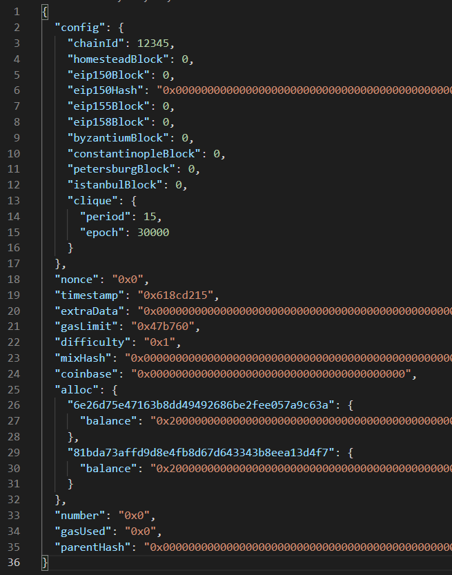
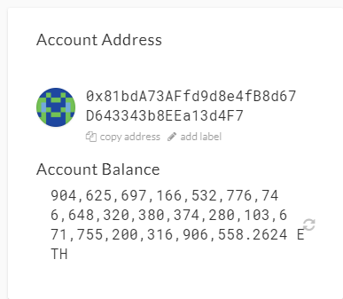

# Running a Proof of Authority Blockchain

## Pre-requisites

[Go Ethereum](https://geth.ethereum.org/) The below procedure was completed using **"Geth & Tools 1.9.7"**

[MyCrypto](https://download.mycrypto.com/). The tools must be installed locally

## Procedure 

The Proof of Authority (PoA) algorithm is typically used for private blockchain networks as it requires pre-approval of, or voting in of, the account addresses that can approve transactions (seal blocks).  

* Create a folder for the new network. In this example. We will call it "casnet"

```
>mkdir casnet
```

* Create accounts for two (or more) nodes for the network with a separate `datadir` for each using `geth`.

```
>.\geth.exe account new --datadir .\<NET_NAME>\<NODE_NAME>

>.\geth.exe account new --datadir .\casnet\casnode1
>.\geth.exe account new --datadir .\casnet\casnode2
```


Copy the public addresses for each node.

* Run `puppeth`, name your network, and select the option to configure a new genesis block.

```
>.\puppeth
```


* Choose the `Clique (Proof of Authority)` consensus algorithm.


* Paste all account addresses from the first step one at a time into the list of accounts to seal.

* Paste them again in the list of accounts to pre-fund. There are no block rewards in PoA, so you'll need to pre-fund.

* You can choose `no` for pre-funding the pre-compiled accounts (0x1 .. 0xff) with wei. This keeps the genesis cleaner.

* Complete the rest of the prompts, and when you are back at the main menu, choose the "Manage existing genesis" option.

* Export genesis configurations. This will fail to create two of the files, but you only need `networkname.json`.

* You can delete the `networkname-harmony.json` file.

* Screenshot the `puppeth` configuration once complete and save it to the Screenshots folder.



* Initialize each node with the new `networkname.json` with `geth`.

```
.\geth.exe init .\casnet\casnet.json --datadir .\casnet\casnode1
.\geth.exe init .\casnet\casnet.json --datadir .\casnet\casnode2
.\geth.exe init .\casnet\casnet.json --datadir .\casnet\casnode3
```

* Run the first node, unlock the account, enable mining, and the RPC flag. Only one node needs RPC enabled.

**COMMANDS**

```
.\geth.exe --datadir .\casnet\casnode1\ --mine --minerthreads 1  --unlock "0x81bdA73AFfd9d8e4fB8d67D643343b8EEa13d4F7" --password .\casnet\password.txt --rpc --allow-insecure-unlock --rpcport 8546
```

**ARGUMENTS USED IN THE ABOVE COMMAND**
```
--datadir <node dir> :  Data directory for the databases and keystore (default: "~/.ethereum")
--mine : Enables mining
--minerthreads <CPUs> : Number of CPU threads to use for mining (default: 0)
--unlock <node public address> :  Comma separated list of accounts to unlock
--password <password file> : Password file to use for non-interactive password input
--rpc : Enable the HTTP-RPC server
--allow-insecure-unlock :  Allow insecure account unlocking when account-related RPCs are exposed by http
--rpcport <port> : HTTP-RPC server listening port (default: 8545)
```


* Set a different peer port for the second node and use the first node's `enode` address as the `bootnode` flag.

* Be sure to unlock the account and enable mining on the second node!

```
./geth --datadir .\casnet\casnode2\ --port 30304 --bootnodes "enode://346f1ae9d3cbdc5b68d4b48ad57f08b1044f4987d860734c4685a8684755dbf262a2535b082192cbe55ecee5fe92b88c3d710dcffbffffe74fff01596b122de1@127.0.0.1:30303" --ipcdisable --allow-insecure-unlock --mine --unlock "0x6e26D75e47163B8dd49492686BE2fEe057a9C63A" --password .\casnet\password.txt
```

```
--datadir .\casnet\casnode2\ :  Data directory for the databases and keystore (default: "~/.ethereum")
--port 30304 : Network listening port (default: 30303). We must use a new one since the Default port is already in use
--bootnodes <enode:xxx...@127.0.0.1:30303" :
--ipcdisable :  Disable the IPC-RPC server
--allow-insecure-unlock : Allow insecure account unlocking when account-related RPCs are exposed by http
--mine : Enables mining
--unlock <node address> : Comma separated list of accounts to unlock
--password <password file> : Password file to use for non-interactive password input

```


* You should now see both nodes producing new blocks, congratulations!


#### Send a test transaction

* Use the MyCrypto GUI wallet to connect to the node with the exposed RPC port.

* You will need to use a custom network, and include the chain ID, and use ETH as the currency.


* Import the keystore file from the `node1/keystore` directory into MyCrypto. This will import the private key.

Node 1 - Initial Balance



* Send a transaction from the `node1` account to the `node2` account.


* Copy the transaction hash and paste it into the "TX Status" section of the app, or click "TX Status" in the popup.


* Celebrate, you just created a blockchain and sent a transaction!


Node 1 - Final Balance


Node 2 - Final Balance

